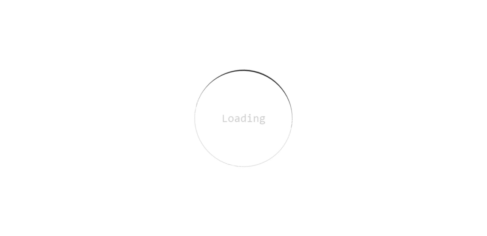
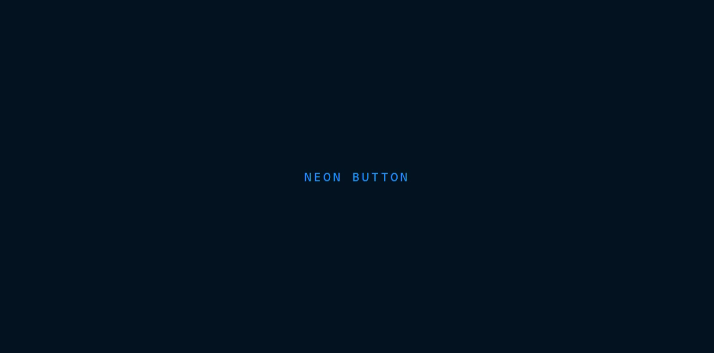
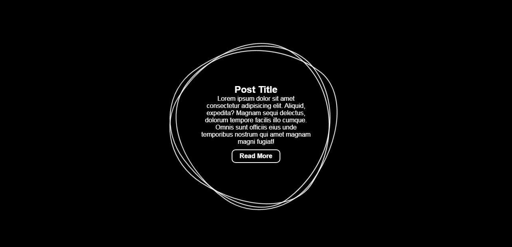
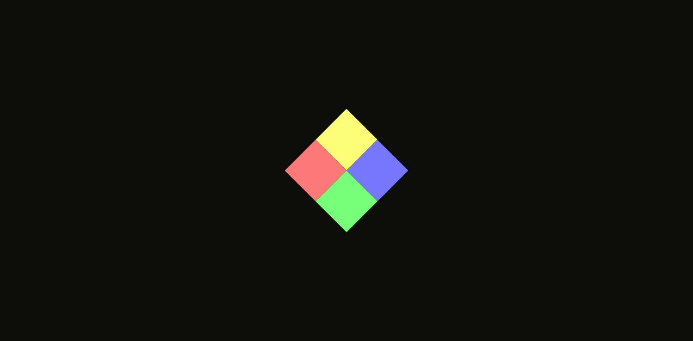
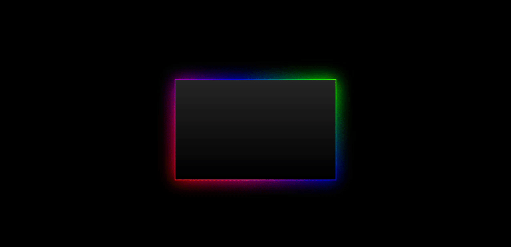

<h1> :technologist: Desafio de 30 projetos em CSS em 30 dias.</h1>

Nesse desafio, o objetivo é desevolver 30 projetos usando CSS e HTML em 30 dias.

## Guia

- <a href="#01">Desafio 01 - Camadas em ícones de redes social</a>
- <a href="#02">Desafio 02 - Loader animado</a>
- <a href="#03">Desafio 03 - Mouse Move Paralax</a>
- <a href="#04">Desafio 04 - Neon Button</a>
- <a href="#05">Desafio 05 - Animação com caixa de texto creativa</a>
- <a href="#06">Desafio 06 - Loading com blocos coloridos animados</a>
- <a href="#07">Desafio 07 - Sombra de caixa com grandient multicolor animado</a>

## Desafios 

### Desafio 01 - Camadas em ícones de redes social

**[Código](https://github.com/jefferson-calmon/challenge-30projects-in-30days/tree/master/desafio-01-icone-social-camadas)**

---

### Desafio 02 - Loader animado

**[Código](https://github.com/jefferson-calmon/challenge-30projects-in-30days/tree/master/desafio-02-loading-animated)**

---

### Desafio 03 - Mouse Move Paralax

**[Código](https://github.com/jefferson-calmon/challenge-30projects-in-30days/tree/master/desafio-03-mouse-move-paralax)**

---

### Desafio 04 - Neon Button

**[Código](https://github.com/jefferson-calmon/challenge-30projects-in-30days/tree/master/desafio-04-button-animated)**

---

### Desafio 05 - Animação com caixa de texto creativa

**[Código](https://github.com/jefferson-calmon/challenge-30projects-in-30days/tree/master/desafio-05-creative-box-animation)**

---

### Desafio 06 - Loading com blocos coloridos animados

**[Código](https://github.com/jefferson-calmon/challenge-30projects-in-30days/tree/master/desafio-06-loading-with-squares-animated)**

---

### Desafio 07 - Sombra de caixa com grandient multicolor animado

**[Código](https://github.com/jefferson-calmon/challenge-30projects-in-30days/tree/master/desafio-07-box-shadow-grandient-multicolor)**

---