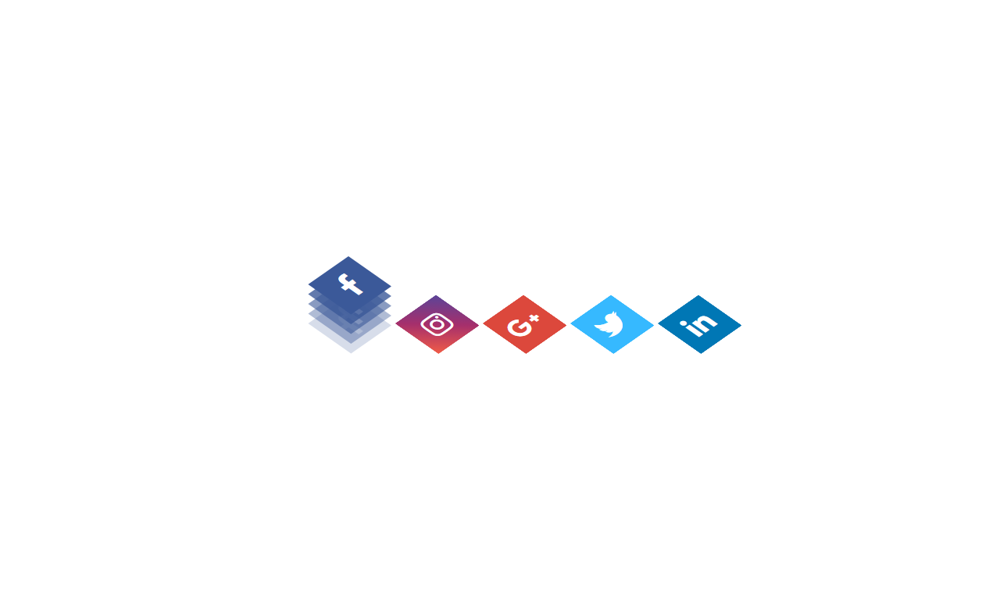
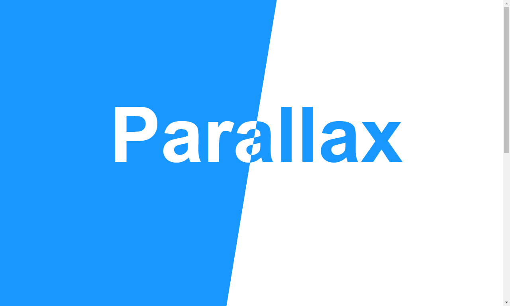

<h1> :technologist: Desafio de 30 projetos em CSS em 30 dias.</h1>

Nesse desafio, o objetivo é desevolver 30 projetos usando CSS e HTML em 30 dias.

## Guia

- <a href="#01">Desafio 01 - Camadas em ícones de redes social</a>
- <a href="#02">Desafio 02 - Loader animado</a>
- <a href="#03">Desafio 03 - Mouse Move Paralax</a>

## Desafios 

### Desafio 01 - Camadas em ícones de redes social

[Código](https://github.com/jefferson-calmon/challenge-30projects-in-30days/tree/master/desafio-01-icone-social-camadas)

---

### Desafio 02 - Loader animado

[Código](https://github.com/jefferson-calmon/challenge-30projects-in-30days/tree/master/desafio-02-loading-animated)

---

### Desafio 03 - Mouse Move Paralax

[Código](https://github.com/jefferson-calmon/challenge-30projects-in-30days/tree/master/desafio-03-mouse-move-paralax)

---